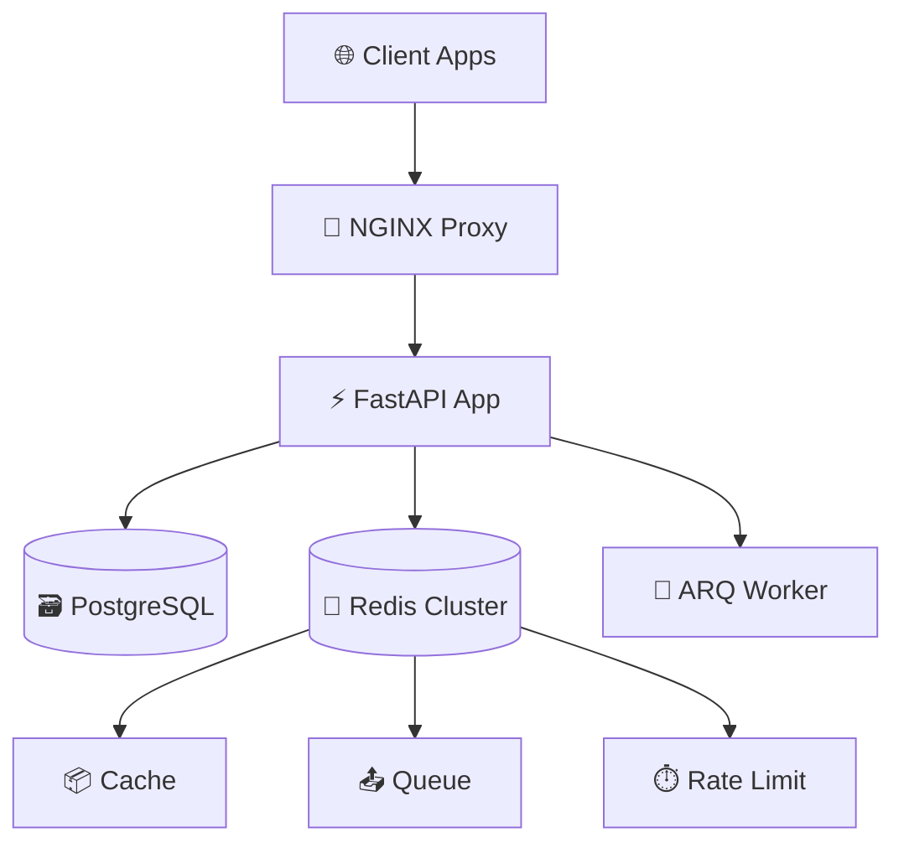
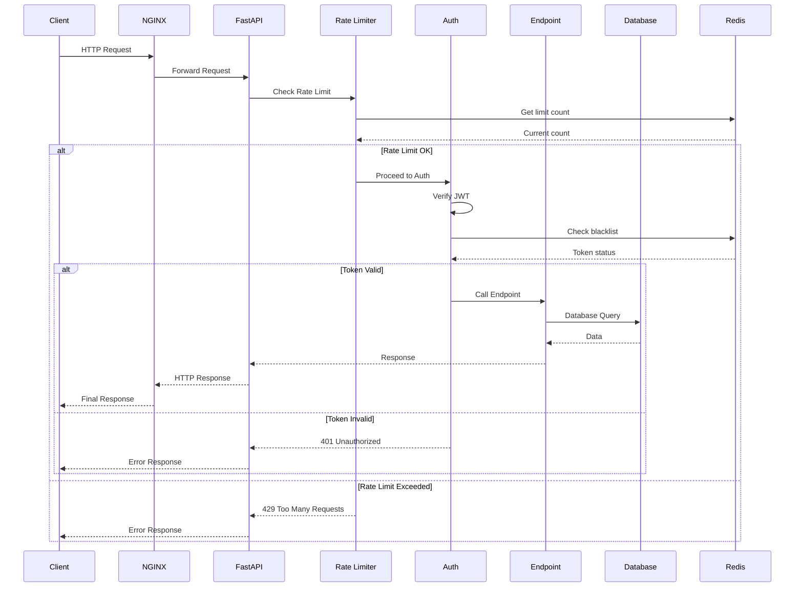

# 🚀 LUỒNG HOẠT ĐỘNG ĐẦY ĐỦ - FASTAPI BOILERPLATE

## 📊 **1. KIẾN TRÚC TỔNG QUAN**



## 🔄 **2. STARTUP SEQUENCE (Khởi tạo ứng dụng)**

### **Phase 1: Pre-Application Setup**
```python
# main.py
1. Import dependencies
2. admin = create_admin_interface()  # Tạo admin UI nếu enabled
3. Định nghĩa lifespan_with_admin()
```

### **Phase 2: Application Factory**
```python
# core/setup.py → create_application()
1. 📋 Cấu hình metadata (title, description, contact)
2. 🔒 Disable docs trong production
3. 🔄 Setup lifespan factory
4. 🏗️ Tạo FastAPI instance
5. 📚 Include API router
6. 💾 Add middleware (client cache)
7. 📖 Setup documentation routes (theo environment)
```

### **Phase 3: Lifespan Initialization**
```python
# Startup sequence:
⚙️  set_threadpool_tokens(100)           # Thread pool limit
💾  create_redis_cache_pool()            # Cache connections
🔄  create_redis_queue_pool()            # Background tasks
⏱️  create_redis_rate_limit_pool()       # Rate limiting
🗃️  create_tables()                      # Database tables
👨‍💼 admin.initialize()                   # Admin interface
✅  initialization_complete.set()        # Ready signal
```

## 🌐 **3. REQUEST LIFECYCLE (Xử lý một request)**

### **Luồng chi tiết cho một API call:**



### **Chi tiết từng bước:**

#### **Step 1: Rate Limiting** ⏱️
```python
# api/dependencies.py → rate_limiter_dependency()

1. Đợi app initialization complete
2. path = sanitize_path(request.url.path)  # "/api/v1/users" → "api_v1_users"
3. Xác định user và tier:
   - Authenticated: Lấy tier-specific limits
   - Anonymous: Dùng IP + default limits
4. Kiểm tra Redis: rate_limiter.is_rate_limited()
5. Nếu vượt limit: raise RateLimitException
```

#### **Step 2: Authentication** 🔐
```python
# api/dependencies.py → get_current_user()

1. Extract JWT từ Authorization header: "Bearer <token>"
2. verify_token(token, TokenType.ACCESS, db):
   - Verify signature với SECRET_KEY
   - Check expiration time
   - Extract payload data
3. Kiểm tra token blacklist trong database
4. Tìm user trong database theo email/username
5. Return user data hoặc raise UnauthorizedException
```

#### **Step 3: Authorization** 🛡️
```python
# api/dependencies.py → get_current_superuser()

1. Kiểm tra user["is_superuser"] == True
2. Nếu false: raise ForbiddenException
```

#### **Step 4: Endpoint Processing** 🎯
```python
# api/v1/users.py (ví dụ)

1. Validate request data với Pydantic schemas
2. CRUD operations với database
3. Apply business logic
4. Return response data
```

## 🔐 **4. AUTHENTICATION FLOW**

### **Login Process:**
```python
# POST /api/v1/login
1. Validate username/password
2. Hash password và compare với database
3. Tạo access_token (30 phút) + refresh_token (7 ngày)
4. Set refresh_token làm HTTP-only cookie
5. Return access_token
```

### **Protected Endpoint Access:**
```python
# GET /api/v1/users/me
1. Extract Bearer token từ header
2. Verify token signature & expiration
3. Check token blacklist
4. Get user data từ database
5. Return user info
```

### **Token Refresh:**
```python
# POST /api/v1/refresh
1. Extract refresh_token từ cookie
2. Verify refresh token
3. Generate new access_token
4. Return new access_token
```

### **Logout Process:**
```python
# POST /api/v1/logout
1. Add access_token vào blacklist
2. Add refresh_token vào blacklist (nếu có)
3. Clear refresh_token cookie
4. Return success message
```

## ⏱️ **5. RATE LIMITING SYSTEM**

### **Tier-based Rate Limiting:**
```python
# Hierarchy: Specific → Tier Default → Global Default

1. Free Tier: 10 requests/hour
2. Premium Tier: 100 requests/hour  
3. Enterprise: 1000 requests/hour

# Path-specific limits:
/api/v1/users: Standard tier limits
/api/v1/ai/generate: 5 requests/day (even for premium)
```

### **Rate Limit Check Process:**
```python
# core/utils/rate_limit.py

1. Key = f"ratelimit:{user_id}:{path}"
2. current_count = redis.get(key)
3. if current_count >= limit:
4.     return True  # Rate limited
5. else:
6.     redis.incr(key)
7.     redis.expire(key, period)
8.     return False  # Allow request
```

## 🔄 **6. BACKGROUND TASKS**

### **ARQ Worker System:**
```python
# Enqueue task:
job = await queue.pool.enqueue_job("send_email", user_email, message)

# Worker processes:
1. Email sending
2. Report generation
3. Data cleanup
4. File processing
```

## 💾 **7. CACHING STRATEGY**

### **Multi-layer Caching:**
```python
# 1. Client-side HTTP caching
Cache-Control: public, max-age=300

# 2. Redis application cache
await cache.set("user:123", user_data, expire=3600)

# 3. Database query optimization
SELECT with proper indexes
```

## 🗃️ **8. DATABASE MODELS**

### **Core Models:**
```python
User:
- id, username, email, hashed_password
- tier_id (FK), is_superuser, timestamps

Tier:
- id, name, description

RateLimit:
- id, tier_id (FK), path, limit, period

Post:
- id, title, content, created_by_user_id (FK)

TokenBlacklist:
- id, token, expires_at
```

## 🔧 **9. CONFIGURATION MANAGEMENT**

### **Settings Hierarchy:**
```python
1. Environment variables (.env file)
2. Default values trong settings classes
3. Runtime configuration updates

# Settings classes:
- AppSettings: Basic app metadata
- DatabaseSettings: DB connection
- RedisCacheSettings: Cache configuration  
- RedisQueueSettings: Background tasks
- RedisRateLimiterSettings: Rate limiting
- CryptSettings: JWT & passwords
- FirstUserSettings: Admin user
```

## 🛠️ **10. ERROR HANDLING**

### **Exception Hierarchy:**
```python
HTTPException
├── UnauthorizedException (401)
├── ForbiddenException (403)
├── NotFoundException (404)
├── DuplicateValueException (409)
└── RateLimitException (429)
```

### **Global Exception Handlers:**
```python
@app.exception_handler(RateLimitException)
async def rate_limit_handler(request, exc):
    return JSONResponse(
        status_code=429,
        content={"error": "Rate limit exceeded"},
        headers={"Retry-After": "60"}
    )
```

## 📊 **11. MONITORING & OBSERVABILITY**

### **Logging System:**
```python
# core/logger.py
1. Structured logging với context
2. Different levels: DEBUG, INFO, WARNING, ERROR
3. Request ID tracking
4. Performance metrics
```

### **Health Checks:**
```python
# Health check endpoints:
GET /health → Basic app status
GET /health/db → Database connectivity  
GET /health/redis → Redis connectivity
```

## 🚀 **12. DEPLOYMENT**

### **Docker Compose Stack:**
```yaml
services:
  web:        # FastAPI application
  worker:     # ARQ background worker
  db:         # PostgreSQL database
  redis:      # Redis cluster
  nginx:      # Reverse proxy (optional)
```

### **Environment Profiles:**
```python
# local: Full docs access, debug mode
# staging: Docs cho superuser only
# production: No docs, optimized settings
```

---

## 🎯 **SUMMARY - Key Takeaways**

1. **Architecture**: Layered architecture với separation of concerns
2. **Security**: JWT + blacklisting, rate limiting, RBAC
3. **Performance**: Redis caching, async I/O, connection pooling
4. **Scalability**: Microservice-ready, horizontal scaling support
5. **Developer Experience**: Auto-docs, type hints, hot reload
6. **Production Ready**: Error handling, monitoring, Docker deployment

Đây là một boilerplate rất comprehensive và production-ready! 🚀